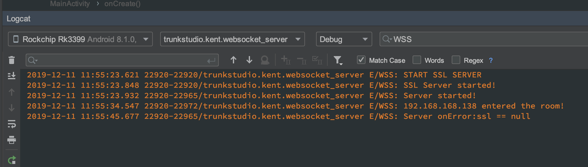

# PoC: Android WebSocket Server with SSL

<!-- descriptions, main goal to deal with -->

An example WebSocket server, to show the possibility of integrating WebSocket with SSL.

It using [Ennova-IT/ZeRXconf](https://github.com/Ennova-IT/ZeRXconf) to broadcast its IP address and using [TooTallNate/Java-WebSocket](https://github.com/TooTallNate/Java-WebSocket) as a WebSocket server provider.

The source code partially comes from Java-WebSocket/SSLServerExample.java and Java-WebSocket/ChatServer.java, ideally, you can use any WebSocket client **supports self-signed certification** to connect.

## Related Repo

<!-- where is your server repo -->

- [TooTallNate/Java-WebSocket](https://github.com/TooTallNate/Java-WebSocket)
- [Ennova-IT/ZeRXconf](https://github.com/Ennova-IT/ZeRXconf)

## Usage

<!-- how to install or build your project -->

1. Build and run by Android Studio in to Android device directly.
2. Take `SSL.cer` from root as client connection certification
3. The server using port `8887` and broadcast name as `Secure WebSocket Server`.

## Limits

<!-- limitation of this POC -->
The PoC only response comes form `WSS` connection, and you can only see connection information at `Logcat` terminal screen. it has no any UI.

## Note

Can use `WSS` as keyword for filter at `Logcat` to quickly get result.
